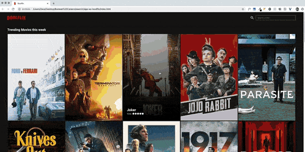

[Disclaimer](#disclaimer) 
[Anteprima](#breve-video-sul-funzionamento) 

# Boolflix
Boolflix è una replica di Netflix realizzata in HTML, CSS e JS. Utilizza l'API https://www.themoviedb.org/documentation/api per recuperare le informazioni attraverso delle chiamate AJAX.

### Caratteristiche
- Nella home sono presenti i 20 film e le 20 serie televisive di tendenza nell'ultima settimana.

- Barra di ricerca che mostra 20 film e 20 serie tv che contengono nel nome il parametro immesso. (La ricerca si avvia ogni volta che l'utente inserisce un qualsiasi caratter [Onkeyup])

- On hover sugli elementi sono mostrati il titolo e la votazione attraverso una piccola animazione dell'immagine, con l'aggiunta di un linear gradient per dar risalto al titolo.

- Il click su ogni elemento fa partire un'animazione che apre una finestra dal basso. La finestra contiene uan serire di dati relativi all'elemento cliccato. Cliccando sulla X o sullo sfondo dietro la finestra è possibile chiudere la finestra stessa.

## Tecnologie usate
HTML, CSS, JS, AJAX, Jquery, Handlebars, API https://www.themoviedb.org/documentation/api.

#### Disclaimer
Le informazioni contenute nella pagina sono recuperate attraverso l'API https://www.themoviedb.org/documentation/api

## Breve Video sul funzionamento

